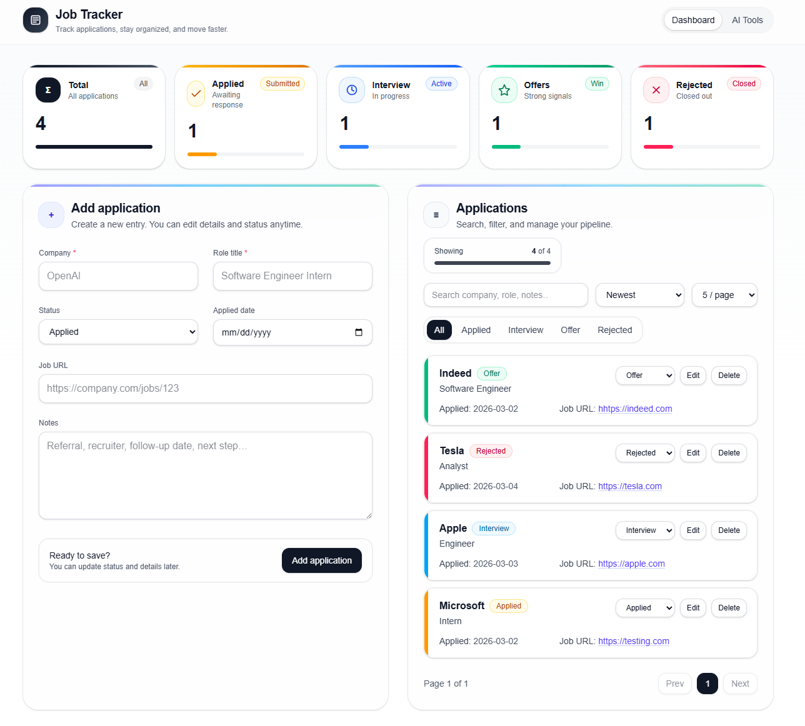
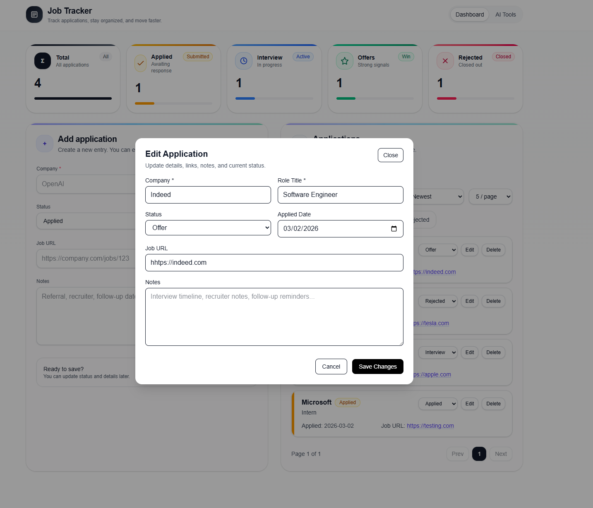
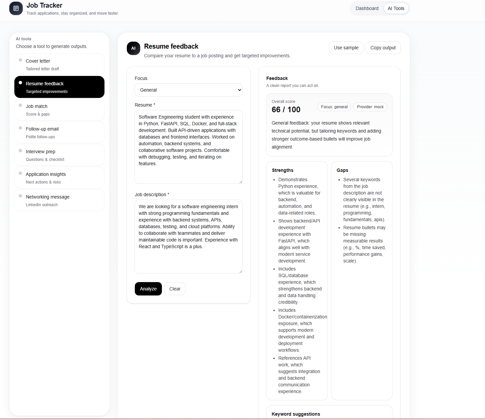
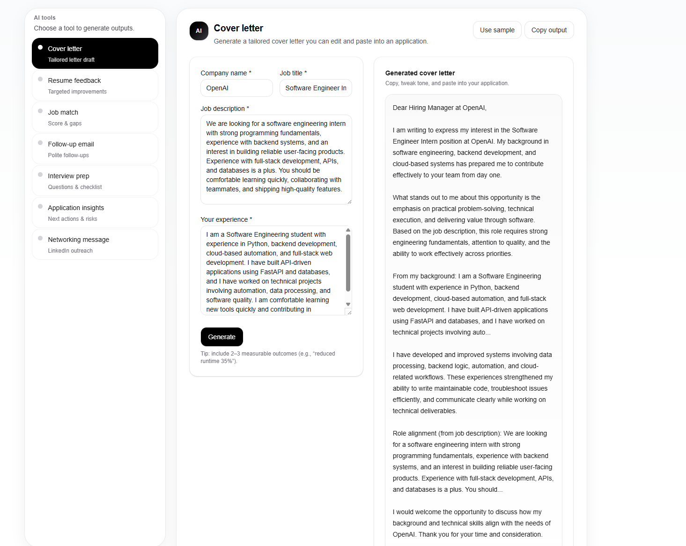
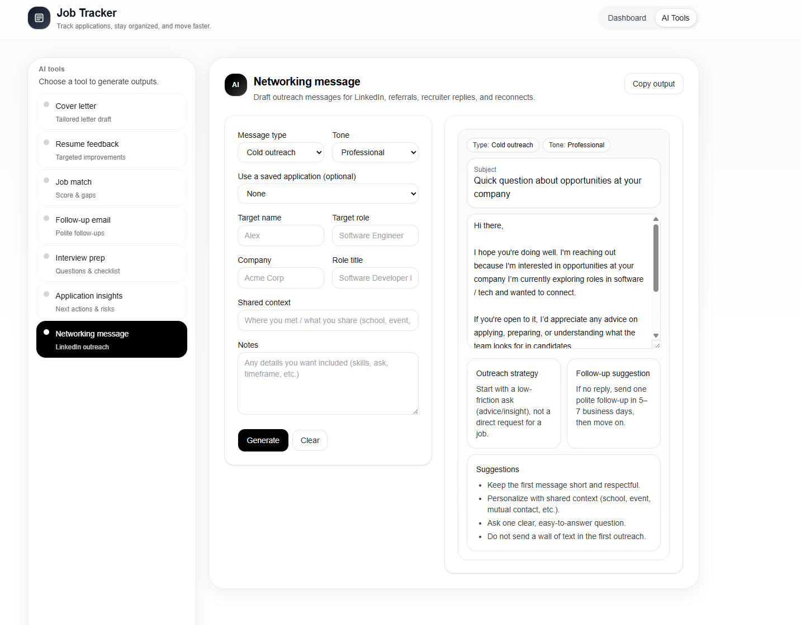
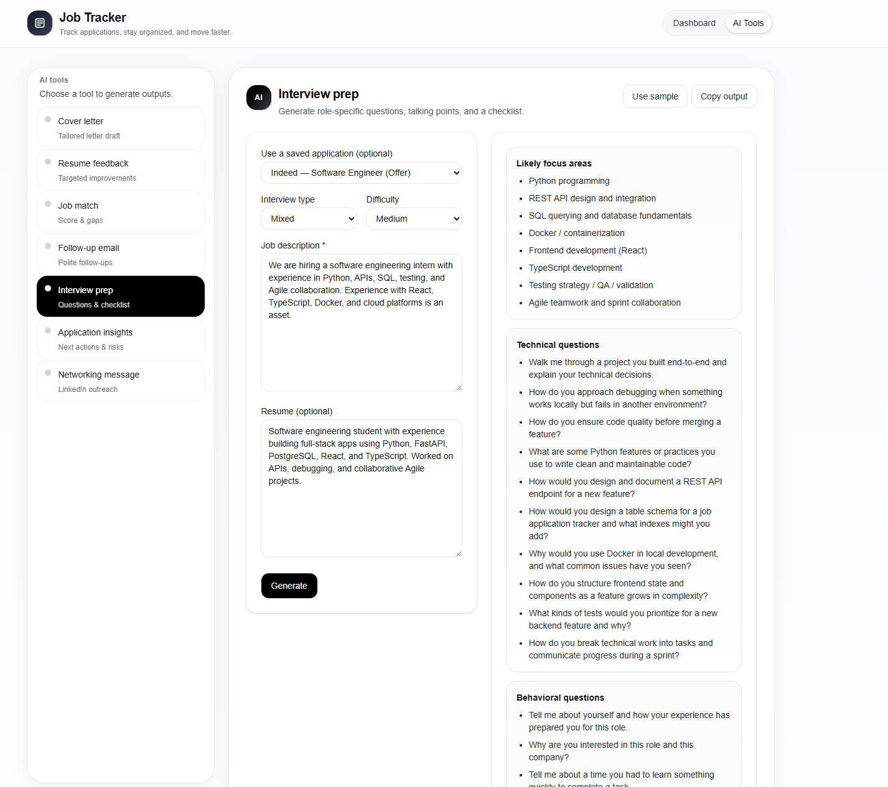
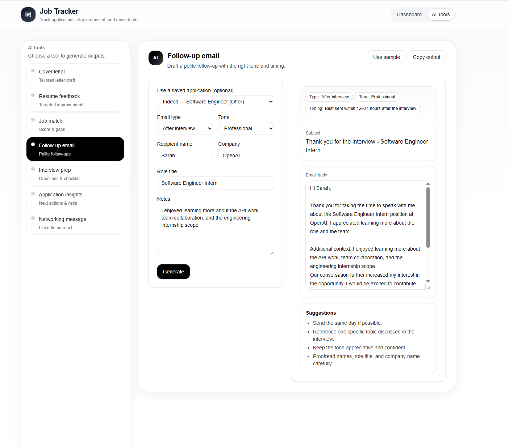
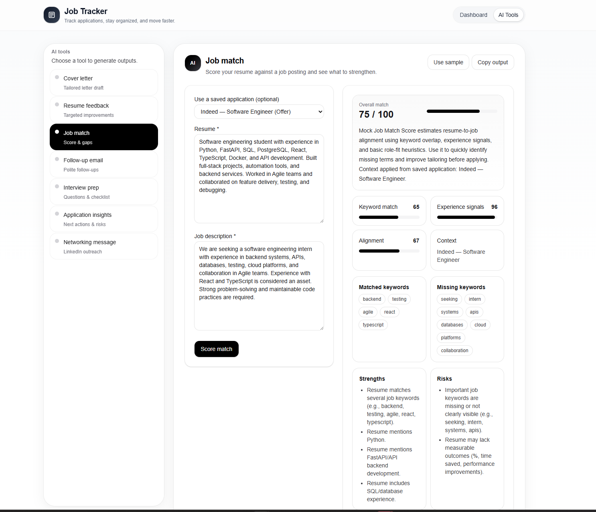
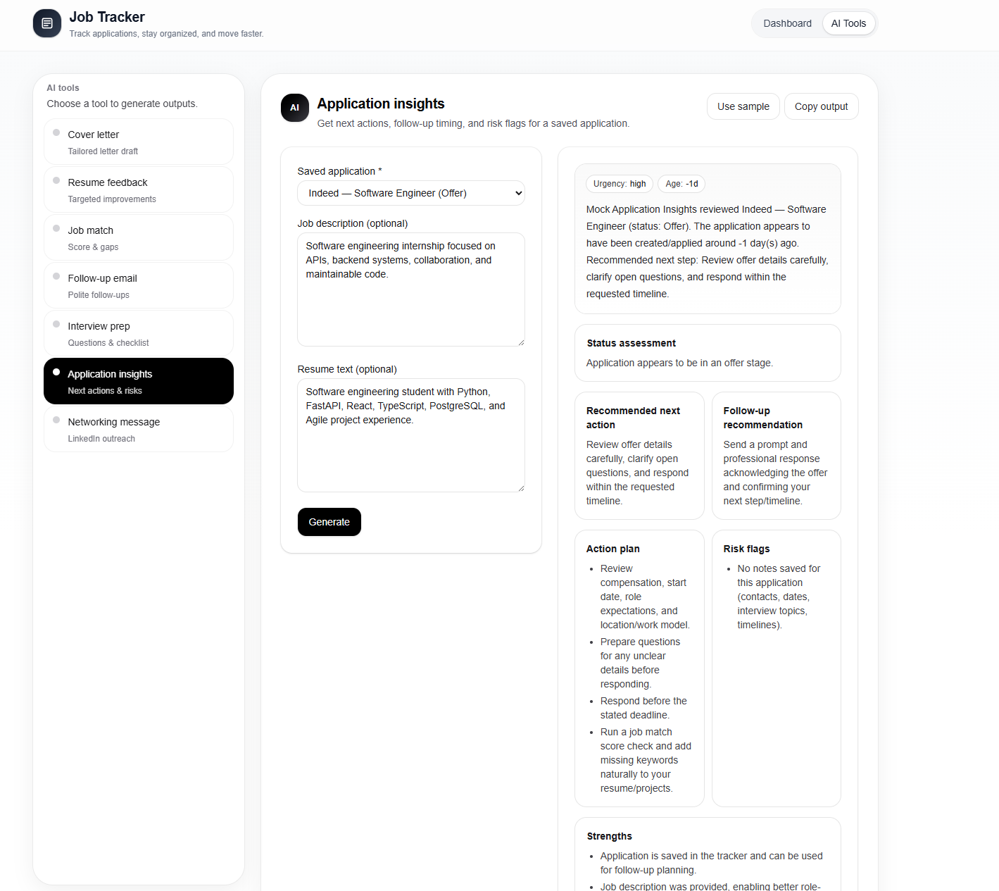

# job-tracker-ai-demo

Full-stack job application tracking system with AI-assisted tools, built using Next.js, FastAPI, and PostgreSQL and deployed on Vercel and Render.

---

## Live Demo

Frontend: https://job-tracker-ai-jade.vercel.app/  
Backend API: https://job-tracker-ai-rryn.onrender.com/health 

---

## Features

- Track job applications with company, role, status, and notes
- Edit and update applications
- Dashboard with application summaries
- AI-powered career tools:
  - Resume Feedback Generator
  - Cover Letter Generator
  - Networking Message Generator
  - Interview Preparation Assistant
  - Follow-Up Email Generator
  - Job Match Score Analyzer
  - Application Insights Analyzer

---

## Tech Stack

**Frontend**

- Next.js
- TypeScript
- Tailwind CSS

**Backend**

- FastAPI
- Python
- SQLAlchemy

**Database**

- PostgreSQL (Neon)

**Deployment**

- Vercel (Frontend)
- Render (Backend)

---

## Screenshots

### Home Dashboard

### Edit Application

### Resume Feedback Tool

### Cover Letter Generator

### Networking Message Generator

### Interview Preparation Tool

### Follow-Up Email Generator

### Job Match Analyzer

### Application Insights Tool

---

## Architecture

Frontend communicates with FastAPI backend via REST API.

Backend handles:

- CRUD operations
- AI tool logic
- Database persistence

---

## Purpose

This project was built to demonstrate full-stack development skills, including:

- Frontend UI/UX design
- REST API development
- Database integration
- Deployment to production
